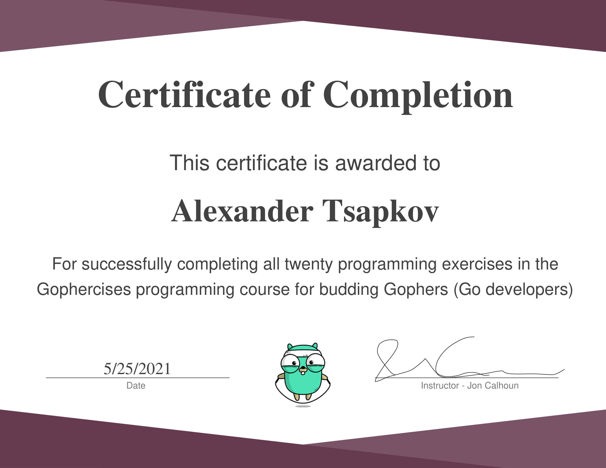

# gophercises

Description
-----------

Golang course from [gophercises.com](https://gophercises.com/).

Exercises
---------

1. [Quiz Game](01-quiz-game)
0. [URL Shortener](02-urlshort)
0. [Choose Your Own Adventure](03-cyoa)
0. [HTML Link Parser](04-link)
0. [Sitemap Builder](05-sitemap)
0. [Hacker Rank Problems - strings and bytes](06-hr1)
0. [CLI Task Manager](07-task)
0. [Phone Number Normalizer](08-phone)
0. [Deck of Cards](09-deck)
0. [Blackjack Game](10-blackjack)
0. [Blackjack AI](11-blackjack-ai)
0. [File Renaming Tool](12-renamer)
0. [Quiet HN](13-quiet-hn)
0. [Panic/Recover Middleware](14-recover)
0. [Panic/Recover Middleware with Chroma](15-recover-chroma)
0. [Twitter Contest CLI](16-twitter)
0. [Secrets CLI & API](17-secret)
0. [Image Transformer](18-transform)
0. [Building Images](19-image)
0. [Building PDFs](20-pdf)

Certificate
-----------

